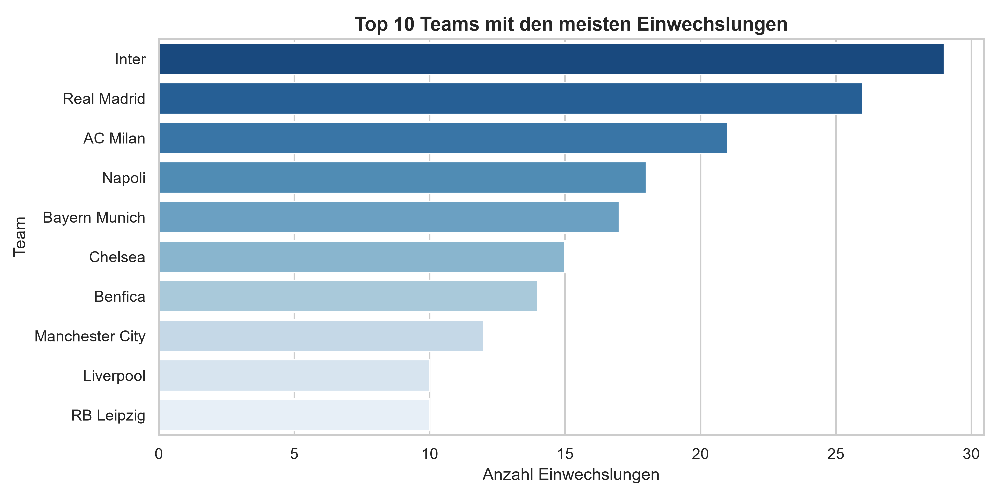

# ⚽ UEFA Champions League – Bench Impact & Substitution Analysis

Eine datengestützte Pipeline und Analyse über das Wechselverhalten und den Einfluss von Ersatzspielern in der K.o.-Phase der UEFA Champions League.


---

## 📊 Key Insights (Erkenntnisse)

* **Joker-Impact:** **22,4 % aller Tore (15 von 67 Toren)** in der K.o.-Phase wurden direkt von eingewechselten Ersatzspielern erzielt (z. B. R. Lukaku, Rodrygo, J. Álvarez).
* **Wechsel-Peak:** Die durchschnittliche Einwechselminute liegt in der **72. Minute** (Median: 74. Minute).
* **Späte Taktik:** Fast die Hälfte aller Wechsel (**46,7 %**) findet erst in der Schlussphase ab der 75. Minute statt.
* **Gesamtdaten:** Ausgewertet wurden **28 K.o.-Spiele** mit insgesamt **214 Einwechslungen**.

---

## 📈 Visualisierungen

### 1. Auswechsel-Zeitpunkte in der K.o.-Phase
Verteilung aller Einwechslungen über 90 Minuten (inkl. Nachspielzeit):


### 2. Top-Teams nach Wechselaktivität
Vergleich der Wechselaktivitäten der Teams:



---

## 🛠️ Technische Umsetzung (Tech Stack)

* **REST-API Integration:** Automatisierter Abruf von Spiel-Events via Python (`requests`) über die *Football-Sports API*.
* **ETL Pipeline:** Robustes Error-Handling (Rate-Limiting, Resumption-Mechanismen via `os.path`) und Aufbereitung verschachtelter JSON-Dateien in strukturiertes CSV.
* **Data Processing:** Bereinigung und Transformation der Rohdaten mit **Pandas**.
* **Data Visualization:** Erstellung publikationsreifer Grafiken mit **Matplotlib** & **Seaborn**.

---

## 📁 Projektstruktur

```text
Ersatzbank_Analyse/
├── data/
│   ├── events/             # API Rohdaten (JSON)
│   └── processed/          # Bereinigte CSV-Daten
├── reports/
│   └── figures/            # Generierte Diagramme
├── scripts/
│   ├── filter_ko_phase.py  # Schritt 1: Filtern der K.o.-Spiele
│   ├── get_events.py       # Schritt 2: API-Abruf mit Rate-Limit Protection
│   ├── parse_events.py     # Schritt 3: ETL & JSON Parsing zu CSV
│   └── analyze_and_plot.py # Schritt 4: Statistische Analyse & Visualisierung
├── requirements.txt        # Projekt-Abhängigkeiten
└── README.md               # Dokumentation