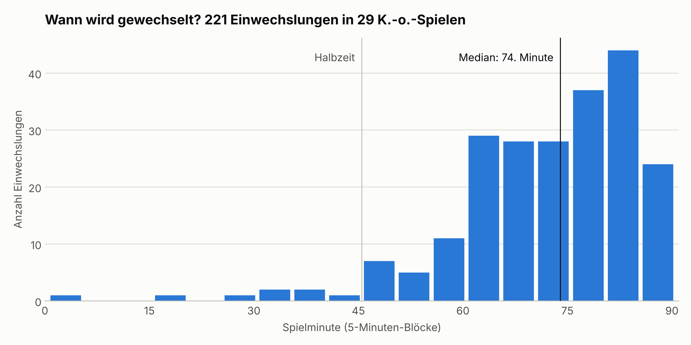
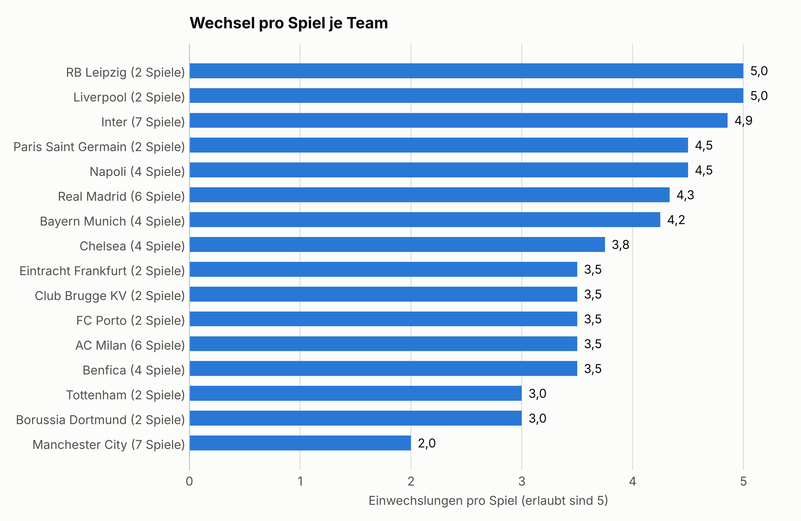

# ⚽ UEFA Champions League – Ersatzbank-Analyse

Wie viel bringen Einwechselspieler, und wann wird gewechselt? Eine kleine Daten-Pipeline von der REST-API über SQLite bis zur Auswertung, am Beispiel der K.-o.-Phase der UEFA Champions League 2022/23.


---

## 📊 Ergebnisse

Ausgewertet sind **alle 29 K.-o.-Spiele** vom Achtelfinale bis zum Finale, mit **221 Einwechslungen** und **68 Toren**.

* **Joker treffen etwa doppelt so oft pro Minute.** Einwechselspieler standen überschlagen nur rund **7 % der Spielzeit** auf dem Platz, erzielten aber **13,2 % der Tore** (9 von 68). Das sind 0,20 Tore pro 90 Minuten gegenüber 0,10 bei Startelfspielern.
* **Gewechselt wird spät.** Die durchschnittliche Einwechslung fällt in die **71,9. Minute** (Median: 74. Minute). **47,5 %** aller Wechsel passieren erst ab der 76. Minute, nur **3,6 %** in der ersten Halbzeit und weitere 3,2 % zur Halbzeit.
* **Die Finalisten wechseln gegensätzlich.** Inter kommt auf **4,9 Wechsel pro Spiel**, Manchester City nur auf **2,0**, bei jeweils 7 Spielen.

Die neun Joker-Tore: R. Lukaku (2), David Neres (2), J. Correa, P. Musa, Marco Asensio, S. Gnabry und J. Álvarez.

**Was ist ein Joker-Tor?** Ein Tor zählt nur dann, wenn der Torschütze *im selben Spiel vor dem Tor* eingewechselt wurde. Ein reiner Namensvergleich über alle Spiele reicht nicht: Wer in einem Spiel eingewechselt wurde und im nächsten von Beginn an spielt, würde sonst fälschlich als Joker zählen.

---

## 📈 Visualisierungen

### 1. Zeitpunkte der Einwechslungen



### 2. Wechsel pro Spiel je Team

Pro Spiel gerechnet, weil Teams, die weiterkommen, mehr Spiele haben.



---

## ⚠️ Einschränkungen

* **Kleine Stichprobe.** Eine Saison, 29 Spiele, 9 Joker-Tore. Die Ergebnisse beschreiben diese K.-o.-Phase und sind keine allgemeine Aussage über Fußball.
* **Spielzeit ist ein Überschlag.** Gerechnet wird von der Einwechslung bis Minute 90 und mit 22 Spielern über 90 Minuten. Nachspielzeit und Platzverweise sind nicht berücksichtigt.
* **Kein Beweis für Ursache und Wirkung.** Eingewechselt werden häufig Offensivspieler, und zwar in einer Phase, in der Spiele offener werden. Das allein kann die höhere Torquote erklären.

---

## 🛠️ Technische Umsetzung

* **REST-API:** Abruf der Spiel- und Event-Daten mit Python (`requests`) über die API-Football (api-sports.io). Der API-Key kommt aus einer Umgebungsvariable und steht nicht im Code.
* **Abruf mit Wiederaufnahme:** `get_events.py` überspringt bereits geladene Spiele, wartet zwischen den Anfragen wegen des Anfragelimits und speichert nur gültige Antworten. Fehlgeschlagene Spiele werden am Ende aufgelistet.
* **Aufbereitung:** Die verschachtelten JSON-Antworten werden mit Pandas in zwei flache CSV-Tabellen überführt (Spiele und Events).
* **Datenbank und SQL:** SQLite mit zwei Tabellen (`fixtures`, `events`), angelegt per `CREATE TABLE`. Ausgewertet wird mit Aggregatfunktionen, `GROUP BY`, einem Self-Join für die Joker-Tore und einer Unterabfrage mit `UNION ALL` für die Wechsel pro Spiel.
* **Auswertung und Grafiken:** Pandas und Matplotlib. Die SQL-Abfragen und die Pandas-Auswertung kommen unabhängig voneinander auf dieselben Zahlen.

### Datenmodell

| Tabelle | Spalte | Bedeutung |
| --- | --- | --- |
| `fixtures` | `fixture_id`, `date`, `round`, `home_team`, `away_team`, `home_goals`, `away_goals` | ein K.-o.-Spiel |
| `fixtures` | `has_events` | 1 = Event-Daten vorhanden, 0 = fehlen noch |
| `events` | `fixture_id`, `minute`, `extra_minute`, `team_name` | Spiel, Minute, Nachspielzeit, Team |
| `events` | `event_type`, `detail` | `Goal` oder `subst`, dazu z. B. `Penalty` |
| `events` | `player_name` | bei Tor: Torschütze, bei Wechsel: Spieler, der rausgeht |
| `events` | `assist_or_in` | bei Tor: Vorlagengeber, bei Wechsel: Spieler, der reinkommt |

---

## ▶️ Ausführen

```bash
pip install -r requirements.txt
```

Die Daten liegen bereits im Repository. Für die Auswertung reichen deshalb die letzten drei Schritte, ein API-Key ist dafür nicht nötig:

```bash
python scripts/parse_events.py       # JSON -> CSV
python scripts/build_sqlite_db.py    # CSV -> SQLite + SQL-Abfragen
python scripts/analyze_and_plot.py   # Kennzahlen + Grafiken
```

Wer die Daten neu abrufen möchte, braucht einen eigenen Key von [API-Football](https://www.api-football.com/) und setzt ihn als Umgebungsvariable:

```bash
# Windows (PowerShell)
$env:API_FOOTBALL_KEY = "dein_key"

# macOS / Linux
export API_FOOTBALL_KEY="dein_key"
```

```bash
python scripts/test_api.py           # prüft den Key
python scripts/get_fixtures.py       # alle Spiele der Saison
python scripts/filter_ko_phase.py    # nur K.-o.-Phase
python scripts/get_events.py         # Events pro Spiel
```

---

## 📁 Projektstruktur

```text
Ersatzbank_Analyse/
├── data/
│   ├── fixtures_raw.json       # alle Spiele der Saison (API-Rohdaten)
│   ├── fixtures_ko.json        # nur die 29 K.-o.-Spiele
│   ├── events/                 # Events pro Spiel (API-Rohdaten)
│   └── processed/
│       ├── fixtures_clean.csv  # eine Zeile pro Spiel
│       └── events_clean.csv    # eine Zeile pro Tor oder Wechsel
├── database/
│   └── ucl_analysis.db         # SQLite-Datenbank
├── reports/
│   └── figures/                # Diagramme (.png)
├── scripts/
│   ├── config.py               # Pfade und API-Zugang
│   ├── test_api.py             # prüft den API-Key
│   ├── get_fixtures.py         # Schritt 1: Spiele der Saison abrufen
│   ├── check_rounds.py         # Hilfsskript: Rundennamen anzeigen
│   ├── filter_ko_phase.py      # Schritt 2: K.-o.-Phase filtern
│   ├── get_events.py           # Schritt 3: Events pro Spiel abrufen
│   ├── parse_events.py         # Schritt 4: JSON zu CSV
│   ├── build_sqlite_db.py      # Schritt 5: SQLite und SQL-Abfragen
│   └── analyze_and_plot.py     # Schritt 6: Auswertung und Grafiken
├── requirements.txt
└── README.md
```
